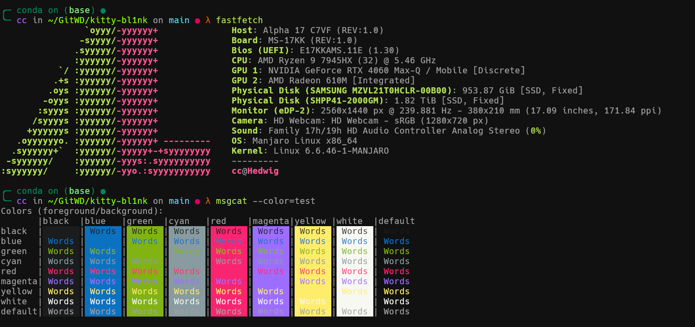

>[!important]
>This theme will replace the `TERM` env to xterm-256color to match the Konsole’s. 

Bl1nk theme from [Konsole bl1nk](https://store.kde.org/p/1220066/)

### Automatic Installation

1. Run  `kitten themes`
2. Search for `bl1nk` and press `Enter`
3. Reload kitty

### Manual Installation

1. Download the `bl1nk.conf` from this repository
2. Place `bl1nk.conf` in `~/.config/kitty/`
3. Add `include bl1nk.conf` to your `kitty.conf` file
4. Reload kitty

## License

bl1nk is marked with [CC0 1.0](https://creativecommons.org/publicdomain/zero/1.0/?ref=chooser-v1) 
